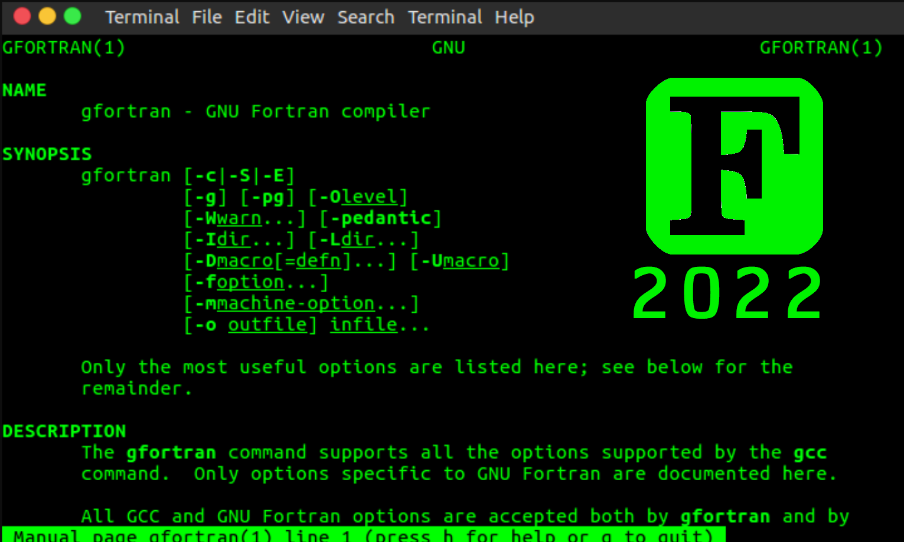

title=12 companies hiring Fortran developers in 2022
description= Not dead yet! IBM's 1950s _Formula Translator_ (FORTRAN) sits in 30th position on the TIOBE index, and has regained some popularity in the High Performance Computing (HPC) world. #1 Hewlett Packart, #2 NVIDIA, #3 Intel, #4 Raytheon...
image=https://compassionate-saha-53a9e6.netlify.app/assets/fortran.png
date=2022-05-12
publish=true
@@@

# 12 Companies hiring `FORTRAN` Engineers

Not dead yet! IBM's 1950s _Formula Translator_ (FORTRAN) sits in 30th position on the TIOBE index ([May 2022](https://www.tiobe.com/tiobe-index/)), and has regained some popularity in the High Performance Computing (HPC) world.

Given its ability to run on 18kb of RAM (at least originally - [IBM704](https://en.wikipedia.org/wiki/IBM_704)), the language has held on for decades as a highly performant tool for mathematics and data analysis. Primarily used in research institutions (ex: [Three-Body Problem](https://degenerateconic.com/circular-restricted-three-body-problem.html)).

But I wanted to scrape around on the internet and find some non-research companies actively hiring for the Fortran developers. Most of these are pulled from public listings which may include irrelevant languages, so I've tried to filter down to companies with explicit Fortran based products.

I found a handfull of companies, typically distributed across these 6 industries:

-   Aerospace & Defense
-   Compilers
-   Energy
-   Graphics Cards
-   High Performance Computing (HPC)
-   Orbital Mapping (asteroids)
-   Weather Modeling

## The top 12:

Ranked in order of _Most needing Fortran_ to _Least needing Fortran_

### 1. Hewlett Packard (Compiler & HPC)

HP maintains the Cray Compilation Environment ([CCE](https://support.hpe.com/hpesc/public/docDisplay?docId=a00115296en_us&page=OpenMP_Overview.html)), so it makes sense they would have a need for Fortran developers. This position mentions updating standards to support Fortran 2023 ([F202X](https://wg5-fortran.org/N2151-N2200/N2194.pdf))

-   **Site**: https://www.hp.com/
-   **Position**: [Fortran Compiler and Runtime Library Developer](https://careers.hpe.com/job/Hewlett-Packard-Enterprise-Grapevine-Texas/166400841)
-   **Preferred skills**: _Modern Fortran experience is a strong plus, the ability to learn Fortran is a requirement_
-   **Description**: _Responsibilities include supporting, optimizing, and enhancing runtime language support such as IO and Fortran intrinsic libraries, developing features, and fixing bugs for the Fortran compiler. Planned feature work will be focused on implementing the next Fortran standard, Fortran 2023._

### 2. NVIDIA (Graphics Cards)

Not surprising since Nvidia has [CUDA FORTRAN](https://developer.nvidia.com/cuda-fortran), a Fortran analog to their CUDA C compiler. CUDA Fortran is a lower-level explicit programming model that allows direct control of GPGPU programming.

-   **Site**: https://www.nvidia.com/
-   **Position**: [Backend Compiler Engineer](https://nvidia.wd5.myworkdayjobs.com/NVIDIAExternalCareerSite/job/US-CA-Santa-Clara/Backend-Compiler-Engineer---New-College-Grad_JR1953464?source=jobboardlinkedin)
-   **Preferred skills**: _Graphics (OpenGL, Vulkan, DX) and Compute (CUDA, PTX, OpenCL, Fortran, C++)_
-   **Description**: _Design and develop new compiler passes and optimizations to produce best-in-class, robust, supportable compiler and tools._

### 3. Intel (HPC)

A few positions requiring Fortran open at Intel. These seem related to the [Aurora Exascale](https://www.intel.com/content/www/us/en/high-performance-computing/supercomputing/exascale-computing.html) system development. (_Exascale computing refers to computing systems capable of at least one exaflop or a billion billion calculations per second (10^18)_)

-   **Site**: https://www.intel.com/
-   **Position**: [Backend Compiler Engineer](https://nvidia.wd5.myworkdayjobs.com/NVIDIAExternalCareerSite/job/US-CA-Santa-Clara/Backend-Compiler-Engineer---New-College-Grad_JR1953464?source=jobboardlinkedin)
-   **Preferred skills**: _Understanding and use of Fortran and C/C++_
-   **Description**: _The team is creating the next Exascale system to help the HPC community get to that next level of performance for both the hardware and software solution._

### 4. General Atomics (Energy - HPC)

General Atomics is an Energy and Defense conglomerate. This position is likely under their nuclear fission / fusion group, working on plasma simulations ([MHD](<https://en.wikipedia.org/wiki/Magnetohydrodynamics#:~:text=Magnetohydrodynamics%20(MHD%3B%20also%20called%20magneto,%2C%20salt%20water%2C%20and%20electrolytes)>) and Computational Fluid Dynamics (CFD).

-   **Site**: https://www.ga.com/
-   **Position**: [Software Developer, HPC](https://sjobs.brassring.com/TGnewUI/Search/home/HomeWithPreLoad?PageType=JobDetails&partnerid=25539&siteid=5313&jobId=4475740&codes=ILNK&dclid=CKDilJK72PcCFSoHaAgdgm0ESg#jobDetails=4475740_5313)
-   **Preferred skills**: _Demonstrable fluency in modern object oriented Fortran, or C/C++ with a willingness to work in Fortran._
-   **Description**: _This position optimizes, benchmarks and tests existing HPC software, including MHD plasma and CFD simulators._

### 5. Raytheon Technologies (Aerospace - HPC)

Another HPC application, this time for the simulation and testing of jet engine design. Under the Pratt & Whitney division, the Survivability Engineering team is developing software tools for simulations and data management regarding infrared and radar electromagnetic evaluation of systems.

-   **Site**: https://www.rtx.com/
-   **Position**: [Software Methods Engineer, Survivability](https://careers.rtx.com/global/en/job/01479871)
-   **Preferred skills**: _Linux, HPC, and SSH operations; scripting with Perl, Python, and Bash; application creation with Fortran, C++, and Java;_
-   **Description**: _Responsible for the development, maintenance, and deployment of software tools used for simulations and data management regarding infrared and radar electromagnetic evaluation of systems, as well as physical and cyber vulnerability. The position requires working on High Performance Computing (HPC) clusters running on Linux._

### 6. Tomorrow.io (Weather)

Weather and climate forecasting is a notoriously complicated space. There's a massive ecosystem of Fortran tools for weather modeling stretching back to the 1980s, and it's often not worth reinventing the wheel ([Climate Models: Challenges for Fortran Development Tools](https://www.researchgate.net/publication/268870715_Climate_Models_Challenges_for_Fortran_Development_Tools)).

-   **Site**: https://www.tomorrow.io/
-   **Position**: [Software Methods Engineer, Survivability](https://boards.greenhouse.io/tomorrow/jobs/4808507003?gh_jid=4808507003&gh_src=713fb7973us)
-   **Preferred skills**: _Programming/scripting experience in Fortran, Python, C++, OpenMP, MPI, Bash._
-   **Description**: _The role is focused on defining, developing, testing, analyzing, and maintaining new and existing components of the Unified Forecast System (UFS) Weather Model and the UFS applications._

### 7. Jacobs Engineering Group (Aerospace - Orbital Modeling)

Develop computer simulation models of hypervelocity impacts on spacecraft materials and perform risk assessment of MMOD impacts on spacecraft components.

-   **Site**: https://jacobs.com/
-   **Position**: [Micrometeoroid & Orbital Debris (MMOD) Impact Engineer](https://boards.eu.greenhouse.io/karmanplus/jobs/4027128101?gh_jid=4027128101)
-   **Preferred skills**: _Experience modeling computer simulations of hypervelocity impacts. Experience with FORTRAN computer programming language._
-   **Description**: _Support the development of in-house computer-based software tools to perform MMOD impact risk analysis of spacecraft._

### 8. Karman+ (Aerospace - Asteroid Mining)

> "We are going to mine near-earth asteroids to provide abundant, sustainable water and mineral resources for the space economy."

Seems that Karman+ literally plans for asteroid mining, starting with retrieval & recovery of Near-Earth Objects (NEOs). I imagine this is similar to the Jacobs _"MMOD"_ position. Keeping track of a large number of orbiting bodies.

-   **Site**: https://karmanplus.com/
-   **Position**: [Senior Data Engineer](https://boards.eu.greenhouse.io/karmanplus/jobs/4027128101?gh_jid=4027128101)
-   **Preferred skills**: _Experience with commonly-used scientific programming languages (Python, Julia, Fortran, etc.)_
-   **Description**: _Produce technical analysis of data and system requirements applicable for data processing and management needs in-flight, in partnership with Karman+ spacecraft and mission design specialists._

### 9. Nasa (Aerospace - Jet Propulsion)

Including Nasa's Jet Propulsion Laboratory here. The Solar System Dynamics Group (SSD) is responsible for mapping and maintaining a database of the 8 planets, 160+ natural satellites, and over one million comets and asteroids.

-   **Site**: https://www.jpl.nasa.gov/
-   **Position**: [Software Engineer for Small-body Ephemeris Development](https://www.jpl.jobs/job/JJPLUSR1928EXTERNALENUS/)
-   **Preferred skills**: _Desired software languages: FORTRAN, Perl, Python, and JavaScript._
-   **Description**: _Maintain and improve SSD’s small-body database, which currently contains orbits of all known asteroids and comets._

### 10. Amazon (Cloud / HPC) [_Needs Verification_]

Same as the Apple case. Listed as a requirement, but I'm unable to find active AWS development in Fortran. I have no doubt that some Fortran code exists somewhere on the AWS HPC team, but hard to say whether it is a priority.

-   **Site**: https://aws.amazon.com/
-   **Position**: [HPC Software Development Engineer](https://www.amazon.jobs/en/jobs/1264017/hpc-software-development-engineer)
-   **Preferred skills**: _Experience implementing compiler vectorization, code generation, or OpenMP runtime libraries. Knowledge of Fortran._
-   **Description**: _The Amazon Web Services (AWS) High Performance Computing (HPC) team is looking for an engineer to develop compilers for the AWS Cloud. The HPC organization builds a suite of tools to help customers with their science, engineering, and machine learning workloads in the AWS Cloud._

### 11. Apple (Computers / HPC) [_Needs Verification_]

It's unclear if there is a direct Fortran position at Apple or if the HR team is just a little overzealous in their requirements. I wasn't able to spot any public facing Fortran tools for Mac, but it's possibly used in their HPC team.

-   **Site**: https://www.apple.com/
-   **Position**: [Software Engineer - Development and Build Tools](https://jobs.apple.com/en-us/details/200353003/software-engineer-development-and-build-tools)
-   **Preferred skills**: _Software development experience in C/C++/Fortran and Python/MATLAB/R_
-   **Description**: _Develop testing workflows for execution of computational models, implement, deliver and support their use in high performance computational environments._

### ??. GE Power (Energy)

Including this one only for the laughs. Perhaps there is a WASM port for Fortran... but I wouldn't typically categorize it under "front-end-technologies".

-   **Site**: https://www.ge.com/
-   **Position**: [Staff Software Engineer](https://jobs.gecareers.com/power/global/en/job/GE11GLOBALR3643308EXTERNALENGLOBAL/Staff-Software-Engineer-Remote?utm_source=linkedin&codes=linkedin&utm_medium=phenom-feeds)
-   **Preferred skills**: _Experience with **front-end technologies** such as Python, ASP.NET, WPF, ASP.NET Core, Javascript, HTML5, CSS, AngularJS, BackboneJS, EmberJS, KnockoutJS, and **Fortran**_
-   **Description**: _The candidate will be responsible for software development lifecycle including activities such as requirement analysis, documentation/procedures and implementation._

## Verification

Still working on verifying a few names in this list, and I'll keep it updated as I receive feedback.

Sent out quite a few of these:

> Hey ${name}, I'm writing up a "10+ companies hiring for Fortran" kind of blog. I see it as a requirement for ${company} positions. Just wanted to verify that it was for real, and not just overzealous job requirements.
>
> Tyler

Also feel free to shoot me an email (tyler@rysolv.com) if you're actively developing in Fortran and you think your company should be on the list.
