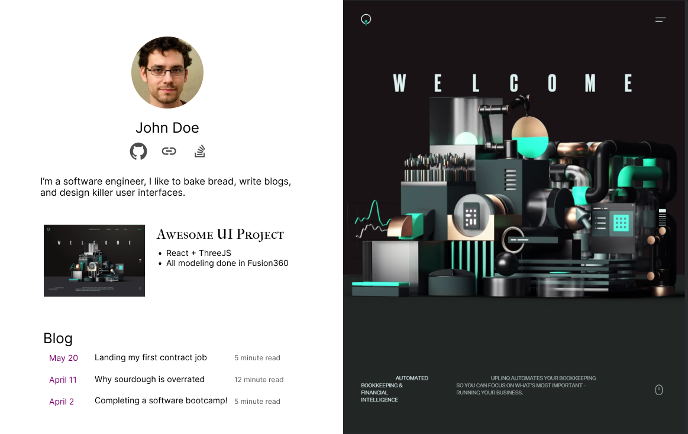
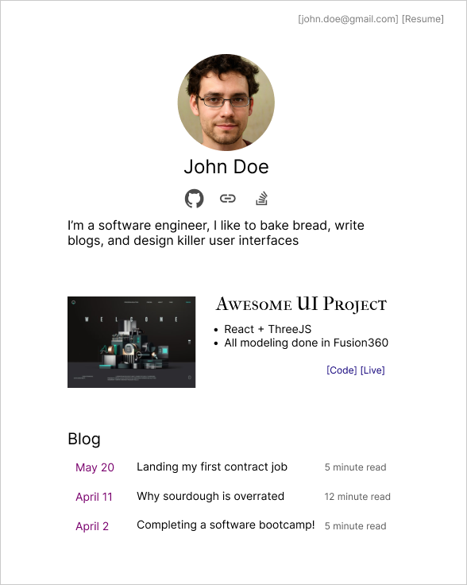
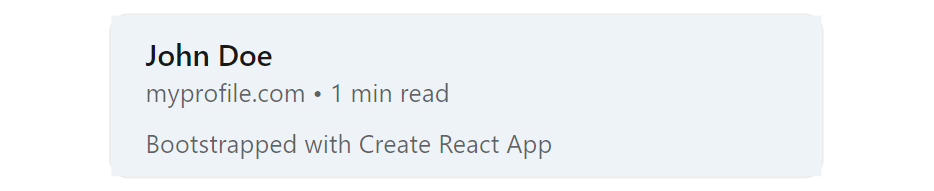
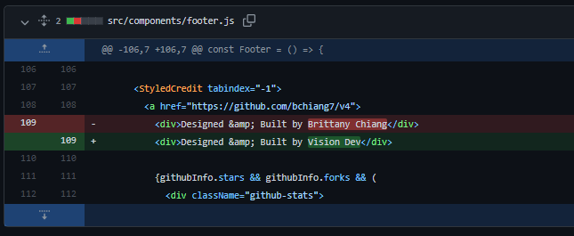
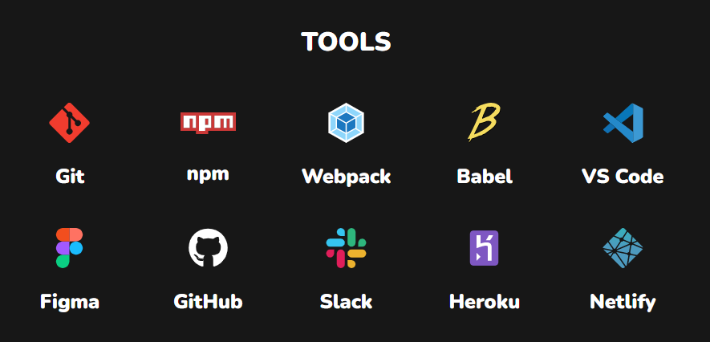

title=How To Build A Simple Developer Portfolio To Get Hired
description=Simple is better. Knowing how to make a functional developer portfolio is key to getting hired.
image=https://compassionate-saha-53a9e6.netlify.app/assets/profile_example.png
date=2022-04-26
publish=true
@@@

# How To Build A Simple Developer Portfolio To Get Hired



### TLDR:

1. You have **less than 10 seconds** to stand out. Make it count.
2. Keep your projects awesome and your profile simple.
3. No one is impressed by templates.
4. Avoid useless UI elements.

There are lots of reasons to build a personal website. It's an opportunity for you to share your interests and creations with the world. And if you want to have a crazy colorful animated profile, then go ahead!

**BUT** if you are specifically trying to land a job, then you'll want to think of your portfolio as more of a resume than an art project. It should be clean, concise, and parsable in less than 10 seconds.

## Is a portfolio website necessary?

For most software engineers, the answer is no. And it's not always obvious that having a profile gives you an advantage over other applicants.

Here's what a portfolio gives you:

1. A place for you to publish work (sites, blogs, designs, artwork, games, etc.).
2. Easier to share than a resume. It's a lot easier to share a profile link than attach a resume to everything.
3. A central point for all your links (GitHub, LinkedIn, Twitter, etc.).

## Keep your projects awesome and your profile simple

I think a lot of new developers want to use their profile to show off all the new CSS and JavaScript tricks they've learned. What they end up with is a flashy unusable nightmare of a site.

#### People have very limited attention spans

Especially when reading through hundreds of applicants. Recruiters look at resumes for [~7 seconds on average](https://www.theladders.com/career-advice/why-do-recruiters-spend-only-7-4-seconds-on-resumes), and you should expect similar behavior on your profile page.
<br>
<br>
If that 7 seconds consists entirely of animations and elements flying onto screen as I scroll, I'll probably never get to the relevant details.

#### Spend more time on your project, and less on your profile

I see lots of developers trying to compensate for a lack of work experience with a flashier profile page. There is a place for awesome animations and unique designs. But it's not on your profile.

### When I say simple, I mean simple:

This right here beats 90% of dev profiles I have seen in terms of usability and functionality.

<br>
<br>
It contains:

-   A way to contact you / read your resume.
-   One memorable sentence describing who you are & what you do.
-   Links where I can learn more about you / your work.

I would reach out to this developer, and I would be very interested to know their thoughts on sourdough.



## What should a portfolio include?

#### 1. The best way to contact you

This one is pretty obvious. Include your email somewhere on the page. And don't make me scroll to the bottom to fill out a `"Contact Me"` form.

#### 2. One interesting sentence about yourself

> ✔ "I am super passionate about technology, mountain biking, and fermenting food."

> ❌ "I am a Full Stack Software Engineer experienced in Django, Express.js, CodeIgniter, Go, React.js, Vue.js, jQuery, React Native, MySQL, PostgreSQL etc and developed many projects Custom ERP Solutions, Trabil, Inventory Management System, Accounting Management System, Social Sites, Ecommerce Platforms etc. I'm a problem solver, and I know the full development cycle from development to deployment."

These are both real examples of applicants I've seen. And obviously I reached out to ask about the fermented food.

#### 3. One or two _quality_ work examples

Pick _one or two_ high quality projects you've completed.

-   Quality > quantity. This is _not_ the place to include the tic-tac-toe game you made in your bootcamp.
-   Include a link to the live site.
-   If you include a repository link, make sure it has a README.

> ✔ Built with Python/Django/React. Worked on a 10 person team.

> ❌Manage overall functions related to the enhancement of web experience from conception/ideation through specifications, design, and development. Triage and research bug tickets raised by customers, while identifying issues via SQL queries, debugging client/server code, and formulating needed adjustments.

Write a bit about the tools, process, and team. But as with everything else, **keep it simple**. Check out Quentin Durand https://mcquint.com for an example of simplicity and high quality design.

#### 4. A PDF resume

Can't avoid it. Lots of large companies require a PDF for their [Applicant Tracking System](https://www.jobscan.co/applicant-tracking-systems).

#### 5. Meta Tags

This one is often forgotten! Chances are your profile will be shared around on Slack, LinkedIn, Discord, etc. All of these services use the `<meta>` tags to create link previews.

I can't count the number of times I've seen this exact exact preview:



Here is an example of properly formatted meta tags. Just copy paste this into your profile:

```
<!-- Base meta tags -->
<meta charset="UTF-8">
<meta http-equiv="X-UA-Compatible" content="IE=edge">
<meta name="description" content="MY_TAG_LINE" />
<meta name="language" content="english" />
<meta name="title" content="MY_NAME" />
<meta name="viewport" content="width=device-width, minimum-scale=1, initial-scale=1, maximum-scale=1.0, user-scalable=2">

<!-- OpenGraph -->
<meta property="og:description" content="MY_TAG_LINE" />
<meta property="og:image" content="SOME_PICTURE" />
<meta property="og:site_name" content="MY_NAME" />
<meta property="og:title" content="MY_NAME" />
<meta property="og:type" content="article" />
<meta property="og:url" content="MY_URL" />

<!-- Twitter -->
<meta name="twitter:card" content="summary_large_image">
<meta name="twitter:description" content="MY_TAG_LINE" />
<meta name="twitter:image" content="SOME_PICTURE" />
<meta name="twitter:title" content="MY_NAME" />
```

## What you should NOT do

#### Don't hijack the scroll bar

Aside from the obvious lack of accessibility, this is just annoying. As many people have pointed out:

-   [The Scroll Hijacking Usability Nightmare](https://www.envato.com/blog/scroll-hijacking/)
-   [Scrolljacking — The Usability Nightmare?](https://medium.com/@paonecreative_87456/scrolljacking-the-usability-nightmare-2a5bbb4273d0)
-   [Why Scroll Hijacking Destroys User Experience](https://buildcreate.com/why-scroll-hijacking-destroys-user-experience/)

#### Don't add the typewriter effect


Seriously. Just no. I shouldn't have to wait for it to type out all the titles you want to use.

#### Don't use a template

1. It's obvious that you're using a template. After a couple weeks of looking at dev profiles you've seen all the popular templates / YouTube tutorials.
2. They're typically too flashy / animated to read.
3. You blend in with everyone else who uses the same template.

#### If you do use a template, attribute the source!



☝️ **DO NOT BE THIS PERSON.** Maybe I take a deeper dive into a candidate than most hiring managers. But if I see you stealing work, I can guarantee you're not getting the job.

#### Don't list languages / logos

This doesn't tell me anything useful. You know how to use `npm`?

I know these are used to make the page feel longer and more filled out. But all it does is give the user more noise to sort through. Don't be afraid of a short page!


