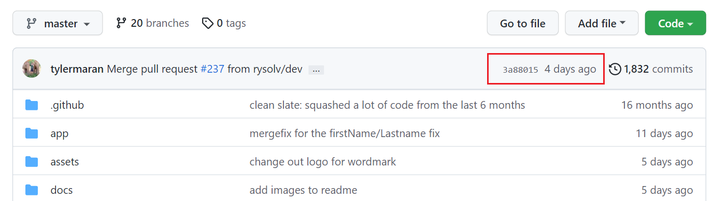
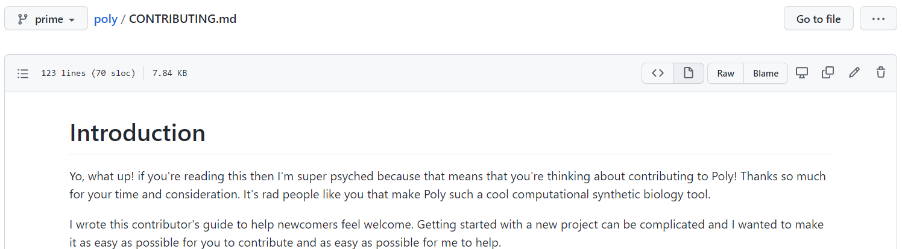
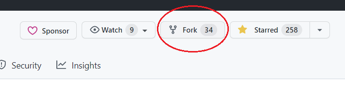
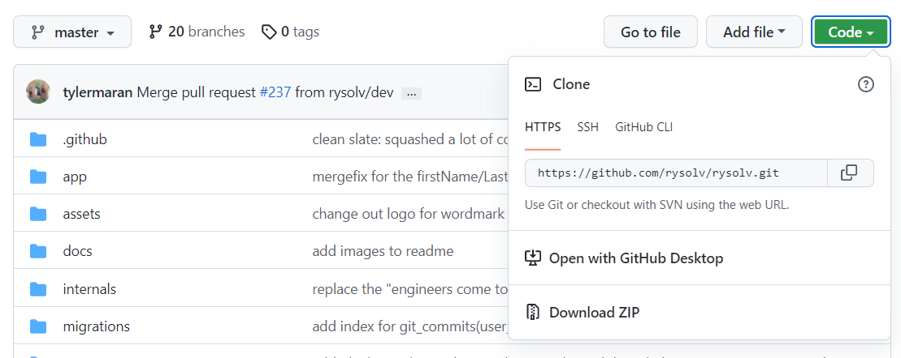
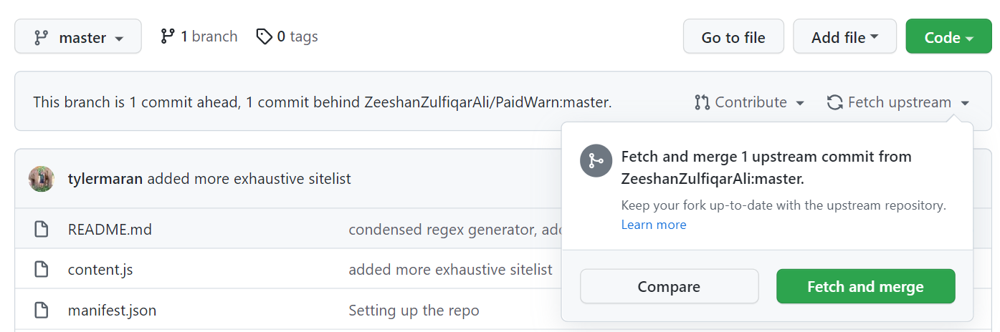
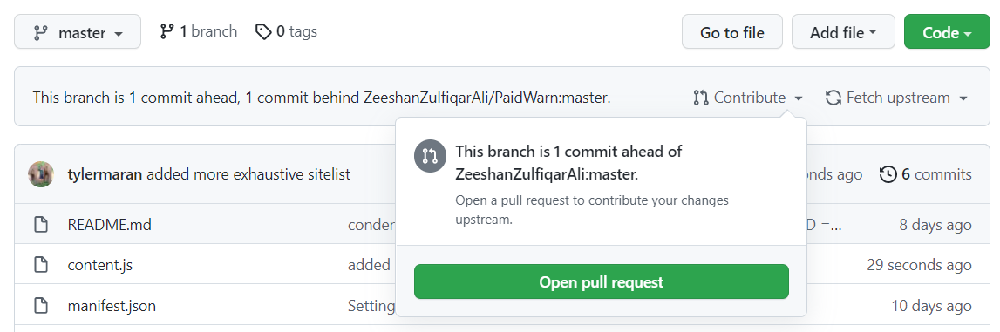
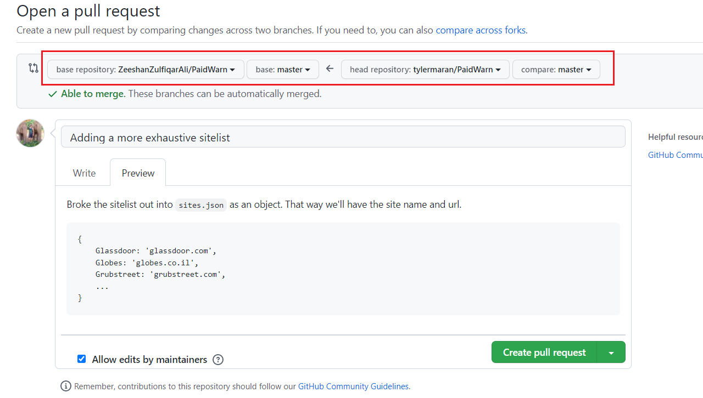
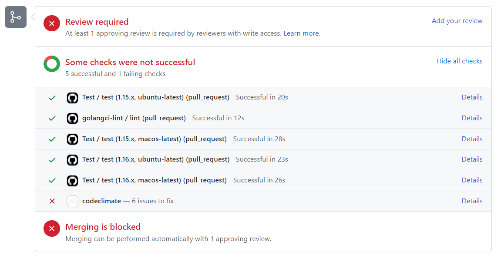

title=Contributing to open source as a beginner [2022]
description=Making your first open source contribution in 2022. How to pick a project. Command-line and GitHub UI instructions.
image=https://compassionate-saha-53a9e6.netlify.app/assets/mutombo_small.gif
date=2022-05-03
publish=true
@@@

# Contributing to open source as a beginner

Contributing to open source is an awesome way to spend your time. You can make friends, better society, and learn a ton about different codebases. But it can be a bit daunting for beginners.

So I've compiled the top technical (and social) tips to make your first OS contribution. If you feel any steps are missing or unclear, good news! [This blog is open source](https://github.com/rysolv/markdown_ssg/tree/rysolv). Go open an issue!

### TLDR:

1.  Find a small project with recent commits (last 2 months)
2.  Take a look at the CONTRIBUTING.md
3.  Fork the repo & start coding
4.  Open a Pull Request to the original repo
5.  Incorporate feedback (and be patient)
6.  Merge & deploy!

## 1. Find a small project with recent commits

Nothing is more demoralizing than spending time on a Pull Request that never gets merged in. Just do a quick check to see the most recent commits. As long as it's less than a few months, you're probably good.

If it's been more than a year, I'd recommend getting in touch with a maintainer (email, discord, etc.) before undertaking any work.



And if this is your first contribution, maybe pick something a little smaller. Don't just look for a typo on the `react` repo. You won't be learning anything new, and there are much better projects that could use your time.

## 2. Take a look at the CONTRIBUTING.md

A lot of active repos (especially larger ones) will have a `CONTRIBUTING.md`. If they do, stop reading this blog and go follow their instructions.

You'll likely also see a `.github` folder containing `PULL_REQUEST_TEMPLATE` and `ISSUE_TEMPLATE`. These are issue and pull request guidelines set by the maintainer. You'll see them pre-filled whenever you open a new Issue or PR.

Make sure to follow these templates (even if it doesn't seem relevant). Sometimes you'll even encounter a bot that auto-closes issues that don't follow the template.



## 3. Fork the repo

Click fork and follow the prompts.



Navigate to your fork of the repo, and clone.



And start coding!

## 4. Open a Pull Request to the original repo

You're now working on your fork of the repo. When you are ready to publish changes you'll be pushing to your GitHub, and then opening a pull request to the original repo.

Remember, always Pull before you Push. With a fork, you'll need to merge any upstream changes into your repo before you create a pull request.

You can do this in either the GitHUb UI, via the command line.

### GitHub UI (easy)

#### 1. Make sure your repo is up to date



#### 2. Open a pull request



#### 2. Confirm the branch, and give a detailed description



### Command Line (a little harder)

#### 1. Add the original repo as an upstream remote

```
// check your upstream repos
git remote -v

origin  https://github.com/tylermaran/PaidWarn.git (fetch)
origin  https://github.com/tylermaran/PaidWarn.git (push)

// Ok that's just my fork, I'll need to add the original
git remote add upstream https://github.com/ZeeshanZulfiqarAli/PaidWarn.git

// And to check it worked
git remote -v

origin          https://github.com/tylermaran/PaidWarn.git (fetch)
origin          https://github.com/tylermaran/PaidWarn.git (push)
upstream        https://github.com/ZeeshanZulfiqarAli/PaidWarn.git (fetch)
upstream        https://github.com/ZeeshanZulfiqarAli/PaidWarn.git (push)

```

#### 2. Make sure your repo is up to date

```
// Fetch the upstream changes
git fetch upstream

// should see something like this from the parent repo
remote: Enumerating objects: 1, done.
remote: Counting objects: 100% (1/1), done.
remote: Total 1 (delta 0), reused 0 (delta 0), pack-reused 0
Unpacking objects: 100% (1/1), 656 bytes | 65.00 KiB/s, done.
From https://github.com/ZeeshanZulfiqarAli/PaidWarn
```

We can pull changes into your local branch, and then push up changes to our repo.

```
// Note we're pulling from 'upstream'
git pull upstream main

// Note we're pushing to 'origin'
git push origin main
```

Or we can just merge the branch

```
git merge upstream/main
```

#### 3. Open a pull request

This is as far as we go from the command line. Unless you want to install the `Hub` CLI from GitHub (https://hub.github.com/).

Otherwise go back to **Step 2** from the GitHub UI instructions.

## 5. Incorporate Feedback (and be patient)

Alright! Your changes are out there and ready for production!

YEA RIGHT.


### Time for the code review

First things first. Get all of the automatic checks pass. This may be a linting check (not matching style guidelines), maybe you forgot to write a corresponding test, or maybe your changes broke something else in the application.

You can reach out for help if you're stuck on some of these checks. But try your best to get the checks passing before requesting a review. Because 99% of the time that review is gonna be "fix your tests".



### Be patient

The maintainers may not be able to review your code immediately. It could take days, weeks, or months. This part goes a lot more smoothly if you reach out in advance to discuss the feature/fix.

And remember, the vast majority of maintainers are doing this for free in their spare time.

You know what you can do in your spare time? Find another open issue and keep contributing.

### Accept feedback

_The best code is consistent and solves the problem at hand_

Maybe you disagree with some feedback you've received. And maybe you're right! Perhaps the existing class method is clunky and your fix would have been an improvement.

At the end of the day it's the maintainer's codebase.

### Keep the Pull Requests readable

Especially as your first contribution. Focus on solving exactly the problem at hand, and try not to touch any unrelated code.


## 6. Merge and deploy!

Your code is in and ready to go! Call your mom, put it on your resume, go on a podcast. You're officially an open source contributor.

**Now do it again**

This part is really important. Repos get tons of _fly-by contributors_. Sneak in, fix a typo, never show up again.

And at the end of the day, it's harder on maintainers to review those pull requests than to just fix the typo themselves. Making small contributions is fine to get started, but the best thing you can do is become a repeat contributor.

Find a project you care about, and make repeat contributions. You'll make friends, learn a ton about different workflows, and you'll be contributing to tools that other people can use.
