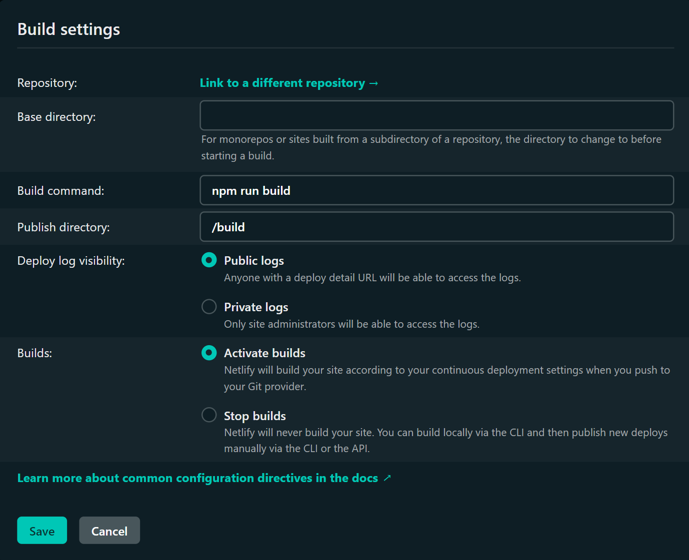

title: Markdown Static Site Generator
description: A stupid simple static site generator for markdown
image: https://compassionate-saha-53a9e6.netlify.app/assets/markdown-to-html.png
date: 2022-02-18
@@@


# A ultra minimal static site generator for Markdown

Yet another static site generator! Cause why not?

I needed to set up a static site generator for some blogging. And while plenty of these exist ([Jekyll](https://jekyllrb.com/), [Gatsby](https://www.gatsbyjs.com/), [etc.](https://jamstack.org/generators/)), none were quite as minimal as I liked. So I built my own! In the interest of productivity, I dedicated one Friday, a 100 lines of JS to this task.

```
🗀 build
🗀 src
    🗀 assets
    hello-world.md
index.js
```

Pull down the ([source](https://github.com/rysolv/markdown_ssg)), and run `npm build` to:

-   Build HTML from markdown & assets in the src directory
-   Create meta tags for social links (standard, OpenGraph, Twitter)
-   Generate a `sitemap.xml`

It uses one dependency ([marked](https://www.npmjs.com/package/marked)), so not totally minimal. But all the build logic lives in 100 lines. With half of the logic dedicated to the meta tags and sitmap generation. The whole repo (including node_modules) adds up to 480kb.

## Why markdown

Well I'm in a code editor all day anyway. I like the [syntax](https://www.markdownguide.org/basic-syntax/).

And the indention is really nice. Especially when I want to provide code snippits. Which I do a lot of when I write tutorials. Since I'm staying in VS code the whole time I can just copy over snippits.

```
// Convert Meta tags to object
const metaObj = meta.split(/\n/).reduce((acc, el) => {
    if (el.length) {
        const [key, value] = el.split(':');
        acc[key] = value.trim();
    }
    return acc;
}, {});
```

## Meta tags & Sitemap

Since the primary goal of this project was to spin up some SEO optimized articles for content marketing, the metatags and sitemap were critical.

To update meta tags, just include the relevant tags at the top of the markdown file, separated by a delininator.

(meta tags for this article)

```
title: Markdown Static Site Generator
description: A stupid simple static site generator for markdown
image: ./assets/markdown-to-html.png
date: 2022-02-18
@ @ @
```

Which generates something like this:

```
<!-- Base meta tags -->
<meta charset="UTF-8">
<meta http-equiv="X-UA-Compatible" content="IE=edge">
<meta name="description" content="A stupid simple static site generator for markdown" />
<meta name="language" content="english" />
<meta name="title" content="Markdown Static Site Generator" />
<meta name="viewport" content="width=device-width, initial-scale=1.0">

<!-- OpenGraph -->
<meta property="og:description" content="A stupid simple static site generator for markdown" />
<meta property="og:image" content="undefined" />
<meta property="og:site_name" content="Rysolv" />
<meta property="og:title" content=Markdown Static Site Generator />
<meta property="og:type" content="article" />
<meta property="og:url" content="https://rysolv.com/blog/getting-started.html" />

<!-- Twitter -->
<meta name="twitter:card" content="summary_large_image">
<meta name="twitter:description" content="A stupid simple static site generator for markdown" />
<meta name="twitter:image" content="" />
<meta name="twitter:title" content="Markdown Static Site Generator" />
```

It also generates a `sitemap.xml` of all the articles in the src directory.

```
<urlset
    xmlns="http://www.sitemaps.org/schemas/sitemap/0.9"
    xmlns:xsi="http://www.w3.org/2001/XMLSchema-instance"
    xsi:schemaLocation="http://www.google.com/schemas/sitemap/0.84 https://www.google.com/schemas/sitemap/0.84/sitemap.xsd">
    <url>
        <loc>https://rysolv.com/blog/getting-started.html</loc>
        <lastmod>2022-02-18</lastmod>
    </url>
</urlset>
```

## Deploying to Netlify

In the spirit of deploying this in an afternoon, I went with (Netlify)[https://www.netlify.com/]. It was really simply to set up. I linked it to my `main` branch on the git repo, set the build step to `npm run build` and the publish directory to `build`


