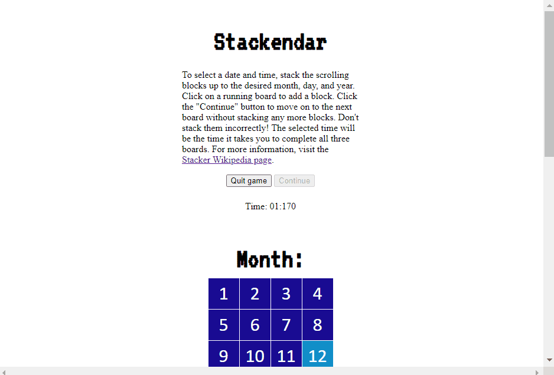
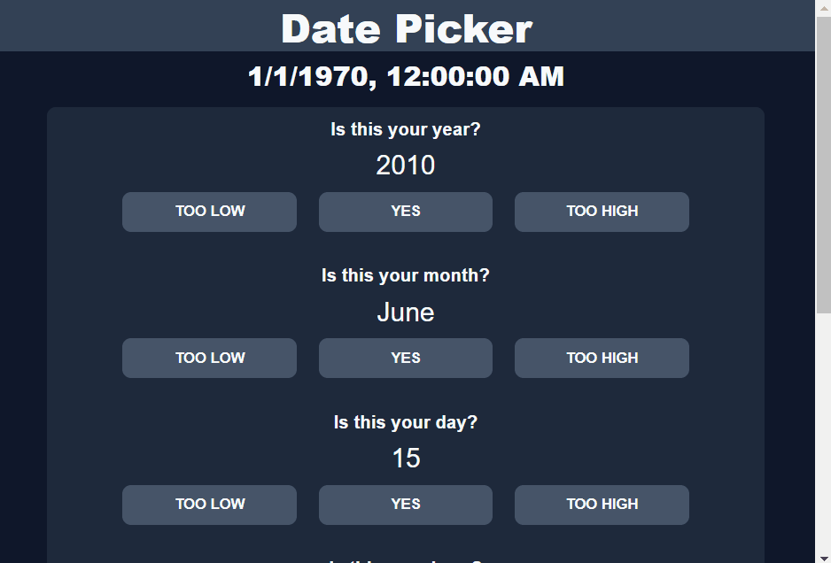
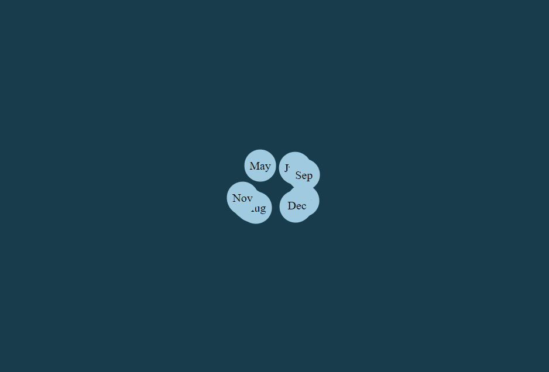
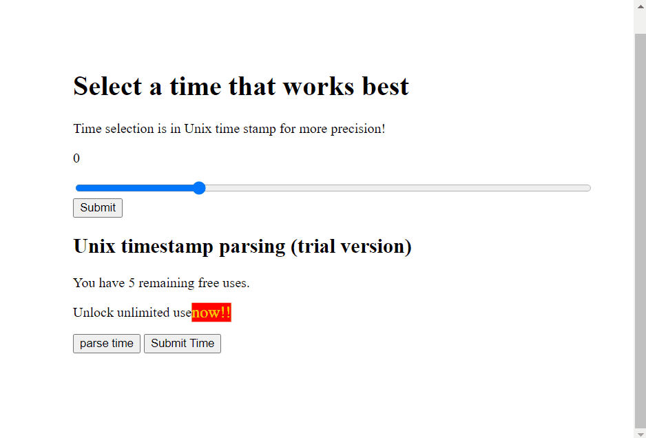
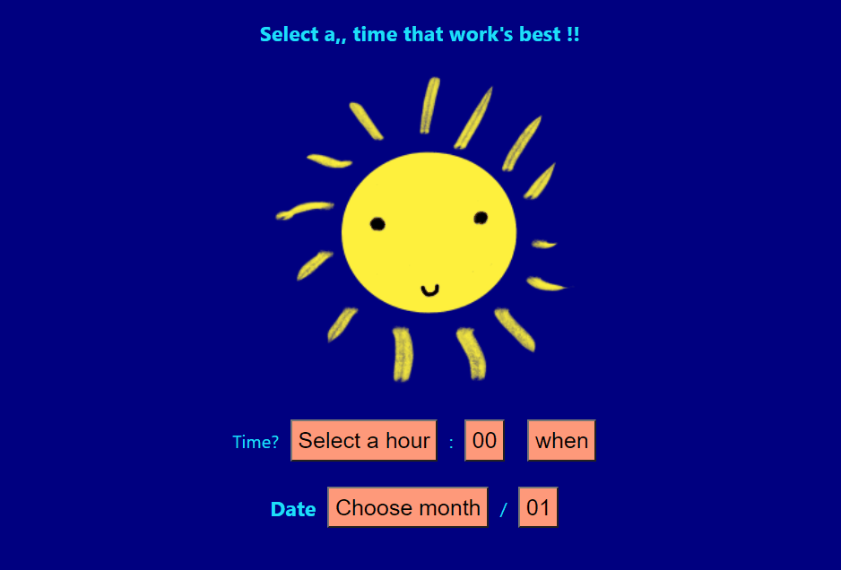
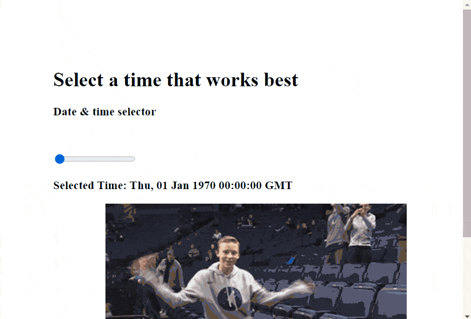
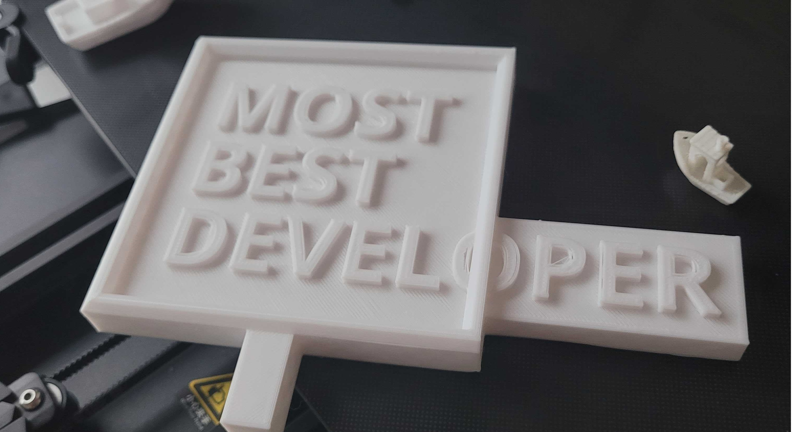

title=Top 10 worst Time/Date selectors
description=Winners from the Rysolv Terrible UI Hackathon
image=https://compassionate-saha-53a9e6.netlify.app/assets/stackendar.gif
date=2022-04-12
publish=true
@@@

# The worst Date Selectors in the world

The results of the [Terrible UI hackathon](https://github.com/rysolv/hackathon) are in! We challenged developes to build the worst Time/Date selectors possible. Here are our top picks!

## Stackendar

Author: [Geforce](https://github.com/Geforce132)

Source: [GitHub](https://github.com/rysolv/hackathon/tree/main/submissions/terrible_ui_1/stackendar)

## Hot & Cold

Author: [Cody Backus](https://github.com/codyback)

Source: [GitHub](https://github.com/rysolv/hackathon/tree/main/submissions/terrible_ui_1/hot_or_cold)

## Bouncing Month and Day

Author: [Colin Fitzgerald](https://github.com/ColinC0de)

Source: [Github](https://github.com/rysolv/hackathon/tree/main/submissions/terrible_ui_1/bad%20UI)

## UNIX Time

Author: [Yingyi Mo](https://github.com/yingmo55)

Source: [GitHub](https://github.com/rysolv/hackathon/tree/main/submissions/terrible_ui_1/unixtime)

## Zodiac

Author: [Nikolai Humphrey-Blanco](https://github.com/nik-seb)

Source: [GitHub](https://github.com/rysolv/hackathon/tree/main/submissions/terrible_ui_1/worst_zodiac_picker)

## Sunshine

Author: [Elise Muellerleile](https://github.com/eliamue)

Source: [GitHub](https://github.com/rysolv/hackathon/tree/main/submissions/terrible_ui_1/bootiful-ui)

## Hampster Time

Author: [Lindsey Jensen](https://github.com/lindsjens/) & John McDaniel

Source: [GitHub](https://github.com/rysolv/hackathon/tree/main/submissions/terrible_ui_1/click%20here)

## 8,640,000,000,000,000 milliseconds

Author: [Zeeshan](https://github.com/ZeeshanZulfiqarAli)

Source: [GitHub](https://github.com/rysolv/hackathon/tree/main/submissions/terrible_ui_1/ingenious_selector)

 
 
 

## The worst prize for the worst developer

The winner of this month's hackathon was [Geforce](https://github.com/Geforce132) with Stackendar! They'll be taking home this lovely 3D printed trophy.

### Join the next one!

This is the first of a series of hackathons that we'll be hosting!

Head over to https://github.com/rysolv/hackathon to sign up for the next one, or [Join us on Discord](https://discord.gg/kqt8RcVggN) for all sorts of software tomfoolery.
